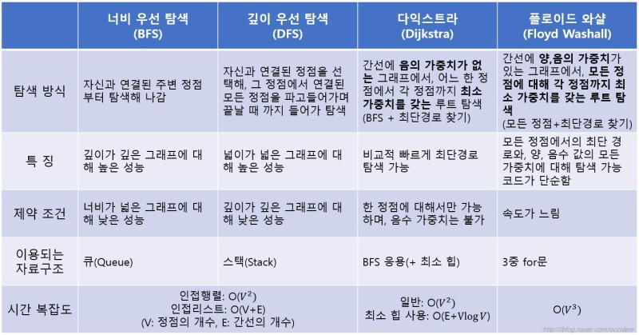

# 07/10 코테 스터디

작성 일시: 2023년 7월 10일 오후 5:22
최종 편집 일시: 2023년 7월 10일 오후 5:30
작성자: myung hun kang
참석자: myung hun kang, 재욱 김
상태: Backlog

그래프는 컴퓨터 과학에서 사용되는 자료구조 중 하나로, 객체들 간의 관계를 표현하는 데 사용됩니다. 그래프는 정점(vertex)과 간선(edge)으로 구성되며, 이러한 구성 요소들을 사용하여 다양한 형태의 관계를 표현할 수 있습니다.

그래프의 주요 특징은 다음과 같습니다:

1. 정점과 간선: 그래프는 정점과 간선의 집합으로 구성됩니다. 정점은 그래프의 구성 요소를 나타내며, 간선은 정점들 사이의 관계를 나타냅니다. 정점은 일반적으로 노드(node)라고도 부릅니다.
2. 방향성: 그래프는 방향성을 가질 수도 있고, 없을 수도 있습니다. 방향 그래프(Directed Graph)는 간선에 방향이 있는 경우를 말하며, 무방향 그래프(Undirected Graph)는 간선에 방향이 없는 경우를 말합니다.
3. 가중치: 그래프의 간선은 가중치(weight)를 가질 수 있습니다. 가중치는 간선을 통해 표현되는 관계의 강도나 비용을 나타내는 값입니다. 예를 들어, 도로망을 그래프로 표현할 때 간선의 가중치는 도로의 거리나 비용을 나타낼 수 있습니다.
4. 순환성: 그래프는 순환(cycle)을 가질 수도 있고, 없을 수도 있습니다. 순환 그래프(Cyclic Graph)는 한 정점에서 출발하여 순환 경로를 따라 자기 자신으로 돌아올 수 있는 그래프를 말합니다. 반면, 비순환 그래프(Acyclic Graph)는 순환 경로를 가지지 않는 그래프를 말합니다.
5. 연결성: 그래프는 정점들 사이의 연결 상태에 따라 연결되었다(connected) 또는 연결되지 않았다(disconnected)고 말할 수 있습니다. 연결된 그래프(Connected Graph)는 그래프 내의 임의의 두 정점 사이에 경로가 존재하는 경우를 말합니다.
6. 서브그래프: 그래프 내에는 서브그래프(Subgraph)가 존재할 수 있습니다. 서브그래프는 원래 그래프에서 일부 정점과 간선을 선택하여 구성된 그래프를 말합니다. 즉, 그래프 내의 일부 정점과 간선을 선택하여 그래프를 축소시킬 수 있습니다.

이러한 특징들을 활용하여 그래프는 다양한 분야에서 응용됩니다. 예를 들어, 소셜 네트워크 분석, 도로망 모델링, 전자 회로 설계, 검색 엔진 알고리즘 등 다양한 분야에서 그래프 자료구조가 유용하게 사용될 수 있습니다.

용어 정리

[https://www.leafcats.com/77](https://www.leafcats.com/77).

그래프 탐색 기법?

[https://m.blog.naver.com/occidere/220923695595](https://m.blog.naver.com/occidere/220923695595)

easy : 1

medium: 1

- - 자유로 1개 풀기

# 다음 시간 목요일 8시
