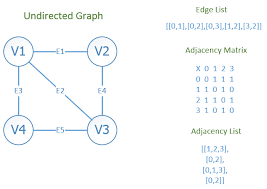

# 07/13 코테 스터디

작성 일시: 2023년 7월 13일 오후 7:47
최종 편집 일시: 2023년 7월 16일 오후 5:47
작성자: myung hun kang
참석자: 재욱 김, myung hun kang
상태: Backlog

명훈

easy

[1791. Find Center of Star Graph](https://leetcode.com/problems/find-center-of-star-graph/)

[1971. Find if Path Exists in Graph](https://leetcode.com/problems/find-if-path-exists-in-graph/)

medium

[797. All Paths From Source to Target](https://leetcode.com/problems/all-paths-from-source-to-target/)

재욱

easy

[1791. Find Center of Star Graph](https://leetcode.com/problems/find-center-of-star-graph/)

[1971. Find if Path Exists in Graph](https://leetcode.com/problems/find-if-path-exists-in-graph/)

medium

[547. Number of Provinces](https://leetcode.com/problems/number-of-provinces/)

그래프 자료구조 표기법

1. edge list
2. adjacent list
3. adjacent matrix

# 다음시간 24일 월

leetcode 스터디 플랜 leetcode 75 Array / String 풀어오기
