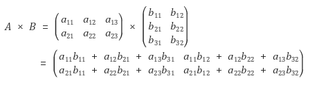

# 01/10 코테 스터디

작성 일시: 2024년 1월 6일 오후 5:28
최종 편집 일시: 2024년 1월 11일 오후 9:27
작성자: myung hun kang
상태: Backlog

행렬테두리 회전하기, 삼각달팽이, 거리두기 확인하기

행렬의 곱셈, 튜플, 짝지어 제거하기

당일 함께 : 문자열 압축, 이진변환 반복하기

명훈

[행렬의 곱셈](https://school.programmers.co.kr/learn/courses/30/lessons/12949)

- 행렬의 곱셈 결과 행령은 arr1.length X arr2[0].length 로 만들어짐
- 정답 배열을 만들고 각 배열안 값은 arr1의 row의 각 값들과 arr2의 column의 [j] 번째 값들의 곱셈의 합

[짝지어 제거하기](https://school.programmers.co.kr/learn/courses/30/lessons/12973)

- 간단한 stack 문제

[튜플](https://school.programmers.co.kr/learn/courses/30/lessons/64065)

- string의 },{ 제거하고 앞 {{ 과 뒤의  }} 도 제거하고 값만 남기도 배열로 바꿈
- 값을 숫자고 바꾸고 정렬
- set에 넣어 중복제거

[삼각 달팽이](https://school.programmers.co.kr/learn/courses/30/lessons/68645)

- 주어진 n에 해당하는 배열을 만듬
- n 까지 반복 while 문으로 안에 왼쪽으로 내려가는 for문 맨 밑에서 오른쪽으로 이동하는 for문 오른쪽에서 위로 이동하는 for문을 만들어 계산
- 한바퀴를 돌면 위쪽 2칸과 맨 밑 1칸이 전부 채워지므로 n -3을 해줌
- idx값 초기 설정과 for문에서 안에 들어가는 숫자와 idx값을 어떻게 +- 할지가 중요

[행렬 테두리 회전하기](https://school.programmers.co.kr/learn/courses/30/lessons/77485)

- 그림 예시처럼 rows와 columns로 배열을 만듬
- 각 query 별로 이동을 하고 최솟값을 answer에 push 함
- 이동은 [x2][y1] → [x1][y1], [x2][y2] → [x2][y1], [x1][y2] → [x2][y2], [x1][y1] → [x1][y2] 순으로 진행
- 단, 처음 [x1][y1] 값은 이동중 사라지므로 미리 빼두고 있다가 다 이동하고 [x1][y1+1] 에 넣기

[거리두기 확인하기](https://school.programmers.co.kr/learn/courses/30/lessons/81302)

- 각 대기실 값 배열로 바꿈
- 대기실 별로 이중 for 문으로 들어가서 거리두기를 지키고 있는지 확인
- 거리두기 확인 함수에서 [ [2,0],[-2,0], [1,1], [-1,1], [0,2], [1,0],[-1,0],[0,1] ] 방향으로 거리두기를 하고 있는지 판단
- 확인하면서 거리두기 안하는거 체크 되면 이중 for문 나가기

재욱

[행렬 테두리 회전하기](https://school.programmers.co.kr/learn/courses/30/lessons/77485)

- rows, columns 크기의 전체 grid 생성.
- queries 에서 주어진 대로 반복문 돌며 하나씩 Stack에 Push.
- 최솟값(답) 찾고, Stack 맨 뒤 원소 맨앞으로 unshift.
- 결과적으로 한칸씩 이동한 Stack을 다시 반복문으로 grid에 삽입.

[삼각 달팽이](https://school.programmers.co.kr/learn/courses/30/lessons/68645)

- 2중 for문으로 i값으로 해결하려 했으나 실패.
- 빈 달팽이 집 삼각형 배열 생성.
- n이 0보다 크다면 n을 3씩 줄여가며
- 아래로, 오른쪽으로, 위로 대각선으로 값을 넣어가며 진행.
- 값을 모두 넣은 뒤 flat() 으로 합해서 답 도출.

[행렬의 곱셈](https://school.programmers.co.kr/learn/courses/30/lessons/12949)

- 행렬의 곱 구하는 공식.

[거리두기 확인하기](https://school.programmers.co.kr/learn/courses/30/lessons/81302)

- BFS 문제.
- 보통 BFS가 한칸 거리를 비교한다면 이 문제는 두칸까지 비교하고 벽까지 고려.
- 2중 for문으로 BFS 내에서 한번더 BFS. (2중 BFS?)

[튜플](https://school.programmers.co.kr/learn/courses/30/lessons/64065)

- 문자열을 배열로 만든 뒤 정렬 후 반복문.
- slice(), split(), includes() 사용.

[짝지어 제거하기](https://school.programmers.co.kr/learn/courses/30/lessons/12973)

- 간단한 Stack 문제.

## 같이 푼 문제

[문자열 압축](https://school.programmers.co.kr/learn/courses/30/lessons/60057)

[이진변환 반복하기](https://school.programmers.co.kr/learn/courses/30/lessons/70129)

## 다음 시간

풀어올 문제

카펫, 소수 찾기, 수식 최대화

같이 풀 문제

H-index, 가장 큰 수
