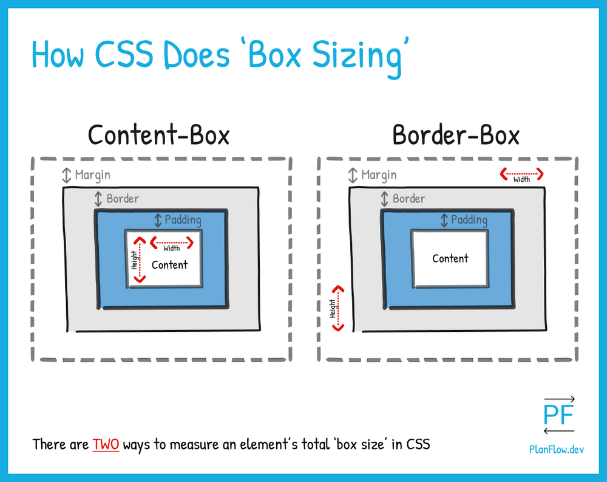

# 05/12 기술 스터디

상태: Backlog
유형: 짧은 회의
작성 일시: 2023년 5월 12일 오후 2:22
작성자: myung hun kang
참석자: 백유리, 재욱 김, 김진영, myung hun kang
최종 편집 일시: 2023년 5월 12일 오후 3:45

# **Flex 와 Grid 의 차이점 #46**

flex → 1차원

grid → 2차원 row , column

# **CSS를 적용하는 방법에 대해 설명해주세요. #49**

1. 인라인 스타일링

   ```jsx
   react - <div style={{ width: "100px", height: "140px" }}></div>;
   js - <div style="width: 100px;  height: 140px;"></div>;
   ```

2. <style> 태그 사용

```html
<head>
  <style>
    div {
    	width: 100px;
    	height: 140px;
    }
    h1 {
    	font-size: 40px; -> rem 이 좋음 ( rem 끼리만 사이즈를 키울 수 있다.)
    }
  </style>
</head>
```

3. css 파일 생성

   ```html
   <head>
     <link rel="stylesheet" href="./style.css" />
   </head>
   ```

```css
div {
  width: 100px;
  height: 140px;
}
h1 {
  font-size: 40px;
}
```

4 js에서 dom 조작

```css
const div = document.querySeletor('div')
const h1 = document.querySeletor('h1')

div.style.width = "100px"
div.style.height = "140px"
div.style.backgroundColor= "red"
h1.style.fontSize = "40px"
```

# **CSS-in-JS #47**

재사용, 가독성

## Emotion과 styled components 의 차이

Emotion과 Styled Components는 모두 React 개발자를 위한 CSS-in-JS 라이브러리입니다. 둘 다 장단점이 있으므로 사용해야 할 특정 라이브러리는 특정 요구 사항에 따라 다릅니다.

**Emotion**

- Emotion은 React 개발자를 위한 가벼운 CSS-in-JS 라이브러리입니다.
- Emotion은 CSS 문법을 직접 사용할 수 있으므로 배우기 쉽습니다.
- Emotion은 성능이 뛰어나고 React의 SSR(Server Side Rendering)을 지원합니다.

**Styled Components**

- Styled Components는 React 개발자를 위한 강력한 CSS-in-JS 라이브러리입니다.
- Styled Components는 CSS 문법을 확장하는 데 사용할 수 있는 자체 API를 제공합니다.
- Styled Components는 모듈식이며 다른 라이브러리와 함께 사용할 수 있습니다.

**어떻게 선택할까요?**

- 가벼운 라이브러리를 찾고 있다면 Emotion이 좋은 선택입니다.
- 강력한 라이브러리를 찾고 있다면 Styled Components가 좋은 선택입니다.
- 성능이 뛰어난 라이브러리를 찾고 있다면 Emotion이 좋은 선택입니다.
- SSR을 지원하는 라이브러리를 찾고 있다면 Emotion이 좋은 선택입니다.
- 모듈식 라이브러리를 찾고 있다면 Styled Components가 좋은 선택입니다.
- 다른 라이브러리와 함께 사용할 수 있는 라이브러리를 찾고 있다면 Styled Components가 좋은 선택입니다.

# **가장 많이 사용되는 position 속성 static, relative, absolute 세가지에 대해 알려주세요. #48**

static : 기본으로 설정되는 값, 아무런 위치 값도 주지 않은 것, 해당 요소의 배치 ( top, bottom, left, right) 이런 값을 조정하지 못한다.

relative: static 상태 였을 때의 위치값을 기준으로 해당 요소의 배치를 바꿀 수 있는 상태로 만들어줌

absolute: 해당 요소와 가장 가까운 relative나 absolute를 가진 요소를 기준으로 배치를 바꿀 수 있는 상태로 만들어줌

fixed: 브라우저 창 왼쪽 위를 기준으로 위치를 조정

sticky: 스크롤로 부모요소가 화면에서 사라지면 브라우저 창 기준으로 지정한 값에 해당하는 위치에 고정

# **box에 대해 이야기 해주세요 #50**



# 다음 일정 월 2시

[https://typescript-exercises.github.io/#exercise=10&file=%2Findex.ts](https://typescript-exercises.github.io/#exercise=10&file=%2Findex.ts) 풀이

다음 질문 주제
