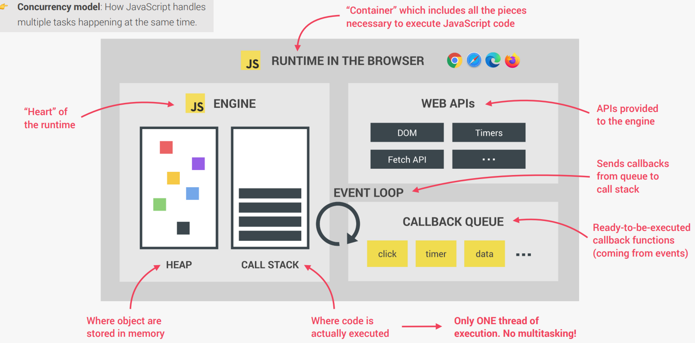
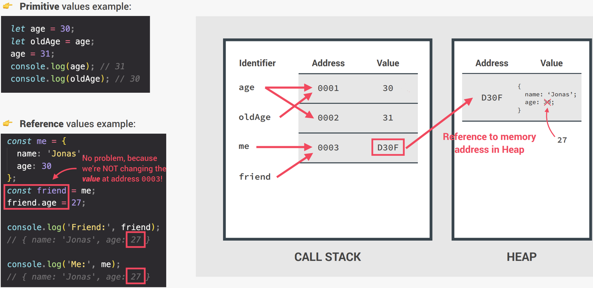

# 05/22 기술 스터디

상태: Backlog
작성 일시: 2023년 5월 22일 오후 1:48
작성자: myung hun kang
참석자: 백유리, myung hun kang, 김진영, 재욱 김
최종 편집 일시: 2023년 5월 22일 오후 3:01

**[브라우저 환경에서의 JavaScript 런타임에 대해 아시나요?](https://github.com/wanted-9th-3team/frontend-study/discussions/51)**

---

1. JS 엔진
   - 각 브라우져마다 JS 엔진을 가지고 있다. ( 크롬 v8, 웹킷, 스파이더몽키 등등)
   - heap 과 call stack으로 나뉜다.
     
     - heap → js 코드안 변수들의 메모리를 할당(저장)할 때 사용하는 공간
     - call stack → js 코드가 실행되는 공간
       왜 이런 방식으로 작동하냐하면 첨부터 object의 values까지 바로 call stack에 저장해버리면 call stack이 너무 커지거든여.
       그래서 대신 거의 무한한(?) heap에 저장되고 스택쪽에선 필요할때만 실제 values가 저장된 heap을 참조만 하는 것
2. Web APIs
   - Js 코드을 읽을 때 Web APIs ( setTimeout, fetch, dom)를 따로 task queue 공간으로 옮기죠……
   - 그리고 call stack에 있는 컨텍스트들을 수행하고 call stack 이 비워지면 event loop가 돌다가 여기에 왔을 때 task를 call stack으로 보낸다.
3. 마이크로 테스크 큐
   - 테스크 큐를 실행하면서 나오는 콜백함수들, mutation observer 를 담아두는 공간
   - 이벤트 루프가 돌면서 이 공간의 테스크들을 모두 수행할때까지 머문다.
   - 테스크들을 수행하면서 나온 부가적인 콜백함수들 또한 다 실행한다.
4. 브라우저 렌더링, RAF (Request Animation Frame)

   - 위에 것들을 이벤트 루프가 돌다가 60분의 1초마다 이벤트 루프가 여기로 들어가서 화면을 다시 그린다.
   - RAF라는 곳에 콜백 함수들이 있을시 이 함수들을 실행하고 렌더링과정을 돈다.

   .gif>)

   

   

   %201.gif>)

   .gif>)

   .gif>)

### 면접에서 나올 만한 질문?

- 이벤트루프 우선순위

  1. call stack

     코드를 읽으면서 Web APIs나 promise와 같은 함수를 해당함수를 수행하는 영역으로 보냄

     이 곳의 모든 task가 마무리 되어야 이벤트 루프가 이동

  2. 마이크로 테스크 큐

     promise의 콜백들을 모두 수행 → 없어질 때까지

  3. 테스크 큐

     여기 있는 테스크 중 하나를 call stack

- setTimeout 0초
  일부러 제일 마지막에 console.log와 같은 것을 실행하기 위해서 setTimeout에 해당 함수넣어서 call stack이 모두 처리된 후에 실행되도록 하는 방법

## 질문거리

- api 통신, http 관련? 브라우저 관련 질문 DNS, SSL→ https,

## typescript 문제 선정

[https://typescript-exercises.github.io/#exercise=14&file=%2Findex.ts](https://typescript-exercises.github.io/#exercise=14&file=%2Findex.ts)

# 다음 일정 목 7시

[https://github.com/wanted-9th-3team/pre-onboarding-9th-4-03/tree/main](https://github.com/wanted-9th-3team/pre-onboarding-9th-4-03/tree/main)

뒤로가기가 안되는중

useEffect에서 setParam으로 pagination에 있는 페이지 값을 넣어주는 식이라 뒤로가기를 해도

현재 페이지에 남아있게되는 중…
