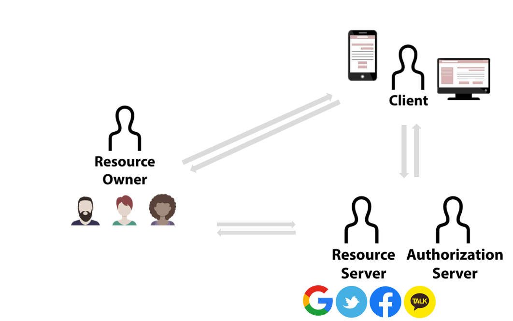

# 06/05 기술 스터디

상태: Backlog
작성 일시: 2023년 6월 5일 오후 2:06
작성자: myung hun kang
참석자: myung hun kang, 김진영, 재욱 김
최종 편집 일시: 2023년 6월 5일 오후 2:29

oAuth 이야기

[https://github.com/wanted-9th-3team/pre-onboarding-9th-4-03](https://github.com/wanted-9th-3team/pre-onboarding-9th-4-03) 페이지네이션 이슈 해결하기

다음 질문거리 주제 정하기

### 이번 주 주제

- 자유주제
- 올라온 질문의 심화버전

### oAuth와 access token & refresh token

- case1 oAuth로 Resource 서버와 통신시 사용
- case2 JWT로 서버와 로그인 유저 인증시 사용

# 다음 시간 금 7시

일정 변동시 디코에 말 남기기
