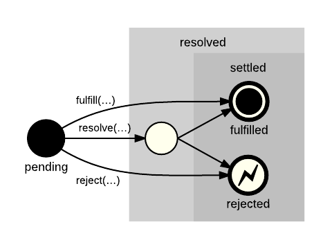

# 06/30 기술 스터디

작성 일시: 2023년 6월 30일 오후 2:59
최종 편집 일시: 2023년 6월 30일 오후 4:48
작성자: myung hun kang
참석자: myung hun kang, 백유리, 김진영, 재욱 김
상태: Backlog

**[semantic tag](https://github.com/wanted-9th-3team/frontend-study/discussions/72)**

[https://www.youtube.com/watch?v=OoA70D2TE0A](https://www.youtube.com/watch?v=OoA70D2TE0A)

**[React Hook Experience](https://github.com/wanted-9th-3team/frontend-study/discussions/73)**

[메타데이터](https://developer.mozilla.org/ko/docs/Glossary/Metadata)는 스타일, 스크립트, 각종 소프트웨어([검색 엔진 (en-US)](https://developer.mozilla.org/en-US/docs/Glossary/Search_engine), [브라우저](https://developer.mozilla.org/ko/docs/Glossary/Browser) 등)의 탐색 및 렌더링을 도와줄 데이터 등 페이지에 대한 정보를 가집니다.

스타일과 스크립트 메타데이터는 페이지 안에서 정의할 수도 있고, 해당하는 정보를 가진 다른 파일로 링크할 수도 있습니다.

- **HTML `<link>`** 요소는 현재 문서와 외부 리소스의 관계를 명시합니다.
  `<link>`는 CSS를 연결할 때 제일 많이 사용하지만, 사이트 아이콘("파비콘"과 홈 화면 아이콘) 연결 등 여러가지로 쓰일 수 있습니다.
- **HTML `<meta>` 요소**는 `base`, `link`, `script`, `style`, `title`과 같은 다른 element로 나타낼 수 없는 Metadata를 나타냅니다.
  **[head 태그에는 무엇이 있을까? HTML의 메타데이터](https://developer.mozilla.org/ko/docs/Learn/HTML/Introduction_to_HTML/The_head_metadata_in_HTML)**
  
  
- **HTML `<style>` 요소**는 문서나 문서 일부에 대한 스타일 정보를 포함합니다.

기사글

[https://dev.to/lydiahallie/javascript-visualized-promises-async-await-5gke](https://dev.to/lydiahallie/javascript-visualized-promises-async-await-5gke)

# 다음 시간 월 2시

다음시간 발표

명훈: 에러핸들링

재욱:

질문거리

아티클 찾아오기

[https://www.notion.so/geneyoung/2022-toss-NEXT-private-c07b79c6c1294ec9a8491d9271698766](https://www.notion.so/2022-toss-NEXT-private-c07b79c6c1294ec9a8491d9271698766?pvs=21)
