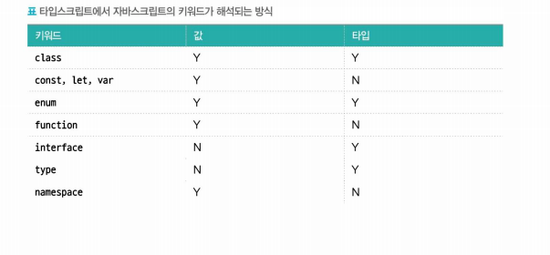

# 11/23 기술 스터디

작성 일시: 2023년 11월 22일 오후 9:24
최종 편집 일시: 2023년 11월 23일 오후 3:24
작성자: myung hun kang
참석자: myung hun kang, 재욱 김, 김진영
상태: Backlog

# 우아한 타입스크립트

## 2.1 타입이란

- 자료형으로서의 타입
  - undefined
  - null
  - Boolean
  - String
  - Symbol
  - Numeric(Number & BigInt)
  - Object
- 집합으로서의 타입
  - 타입 ⇒ 값이 가질 수 있는 유효한 범위의 집합
- 정적 타입과 동적 타입
  - 정적 타입 ⇒ 컴파일 타임에 변수의 타입 결정 (C, 자바, 타입스크립트)
  - 동적 타입 ⇒ 런타임에 변수의 타입 결정(파이썬, 자바스크립트)
- 강타입과 약타입
  - 강타입⇒ 서로 다른 타입을 갖는 값끼리 연산시도 시 - 컴파일러 또는 인터프리터 에러 발생(파이썬, 루비, 타입스크립트)
  - 약타입 ⇒ 위와 동일 상황 시 - 컴파일러 또는 인터프리터가 내부적으로 값의 타입을 변환하여 연산 수행(C++, 자바, 자바스크립트)
- 컴파일 방식
  - 타입스크립트는 자바스크립트에 타입이라는 레이어를 끼얹은 일종의 템플릿 언어 또는 확장언어로 해석하는 의견이 있다.
  - → 타입스크립트의 컴파일 결과물이 타입이 모두 제거된 자바스크립트 파일이기 때문.

> ‘**정적 타입 = 강타입 , 동적타입 = 약타입’ 이 아니다!!
> 타입스크립트의 컴파일 결과 → 자바스크립트**

## 2.2 타입스크립트의 타입 시스템

- 타입 애너테이션 방식
  - 변수나 상수 혹은 함수의 인자와 반환 값에 타입을 명시적으로 선언해서 어떤 타입 값이 저장될 것인지를 컴파일러에 직접 알려주는 문법
- 구조적 타이핑
  - 이름으로 타입을 구분하는 명목적인 타입 언어의 특징과 달리 타입스크립트는 구조로 타입을 구분한다.
  ```tsx
  interface Developer {
  	faceValue: number;
  }

  interface Banknote {
  	falceValue: number;
  }

  let developer: Developer = { faceValue: 52 };
  let bankNote: BankNote = { faceValue: 10000}

  developer = bankNote: // 문제 없음
  bankNote = developer: // 문제 없음
  ```
- 구조적 서브타이핑
  - 타입스크립트의 타입은 값의 집합으로 생각할 수 있다.
  ```tsx
  type stringOrNumber = string | number;
  ```
- 자바스크립트를 닮은 타입스크립트
  - 자바스크립트 → 덕 타이핑 기반 (매개변숫 값이 올바르게 주어지면 어떻게 만들어졌는지 신경 쓰지 않고 사용한다는 개념)
  - 타입스크립트는 이런 동작을 그래도 모델링
- 구조적 타이핑 결과
  - 예기치 못한 결과가 나올 수도 있다.
  ```tsx
  interface Cube {
  	width: number;
  	height: number;
  	depth: number;
  }

  function addLine(c:Cube){
  	let total = 0;

  	for(const axis of Object.keys(c)){
  		// Element implicitly has an 'any' type
  		// No index signature with a parameter of type 'string'

  		const lehgth = c[axis];

  		total += length
  	}
  ```
  - 타입스크립트에 명목적 타이핑 언어의 특징을 가미한 식별할 수 있는 유니온 같은 방법이 있다.
- 타입스크립트의 점진적 타입 확인
  - 점진적 타입 검사 → 컴파일 타임에 타입을 검사하면서 필요에 따라 타입 선언 생략을 허용하는 방식
  - 이러한 특징 때문에 모든 변수와 표현식의 타입을 컴파일타임에 감사하지 않아도 되기 때문에 타입이 올바르게 정해지지 않으면 런타임에서 에러가 발생하기도 한다.
- 자바스크립트 슈퍼셋으로서의 타입스크립트
- 값 vs 타입
  - 프로그래밍 관점에서 값 = 문자열, 숫자, 변수, 매개변수, 객체, 함수
  - 값 뒤에 : type 형태로 타입을 명시
  - 타입은 type 이나 interface로 선언해서 이름이 같아도 서로 충돌하지 않는다.
  - 클래스는 값과 타입 공간 모두에 포함될 수 있다.
  - enum도 클래스처럼 타입 공간에서 타입을 제한하는 역할을 하지만 자바스크립트 런타임에서 실제 값으로도 사용될 수 있다.
  
- 타입을 확인하는 방법
  - typeof = 연산하기 전에 피연산자의 데이터 타입을 나타내는 문자열을 반환 → 7가지 기본 데이터 타입 + 함수 , 호스트 객체 그리고 object 객체
  - instanceof = 프로토타입 체이닝 어딘가에 생성자의 프로토타입 속성이 존재하는지 판단할 수 있다.

> 구조적 타이핑의 결과 → 이상한 예기치 못한 오류가 발생하는 이유
> 값 vs 타입 비교 중요해보임!
> 타입 확인 방법 (typeof , instanceof) → 추후 타입 가드 같은 내용에 도움이 될 것 같다.
> enum 은 회사의 컨벤션따라가는걸로 …. ( enum에 대한 우형 팀의 생각 잘 이해해두는 것이 좋을 것 같다. )

## 2.3 원시 타입

자바스크립트의 내장 타입은 파스칼 표기법으로 표기 → 타입스크립트에서는 소문자로 표기

> 각 원시 타입 이해
> null 이랑 undefined 차이 잘 알아두기

## 2.4 객체 타입

타입스크립트는 다양한 형태를 가지는 객체마다 개별적으로 타입을 지정할 수 있다.

- type과 interface 키워드
  - 일반적으로 변수 타입을 명시적으로 선언하지 않아도 컴파일러가 자동으로 타입을 추론 → 모든 변수를 명시적으로 선언할 필요는 없다.
- function
  - 함수에 별도 타입 지정
  ```tsx
  function add(a: number, b: number): number {
    return a + b;
  }
  ```
  - 함수 자체의 타입 지정
  ```tsx
  type add = (a: number, b: number) => number;
  ```
  호출 시그니처는 무조건 화살표 함수 방식으로만 정의

> type 과 interface 키워드를 언제 어떤 걸 쓸지 →사용하는 기준을 잘 세우는게 좋아 보인다. (우형 팀 이야기를 잘 알아보기)

## 2장 마무리

- 아는 내용도 많고 정확하게 모르는 내용도 많았는데 개념을 잘 정립하는 장이었다.
- 타입스크립트에 대해 잘 모르는 사람이 보기에는 내용이 중구난방인거 같다. → 어느 정도 지식이 있는 사람에게는 도움이 될 수 있어보인다.
- 말로 설명하기에는 잘 모르던 개념들을 알아보는 장이 되었다.

# 다음 시간 수 7시

### 3장 고급 타입 내용 읽어오기
