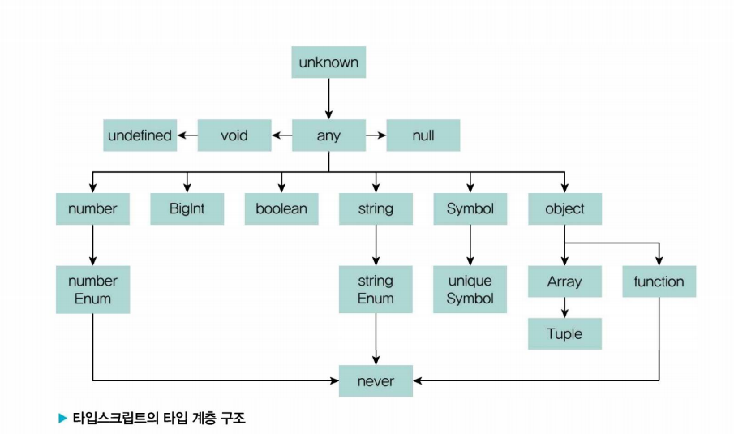

# 11/29 기술 스터디

작성 일시: 2023년 11월 28일 오전 11:17
최종 편집 일시: 2023년 11월 29일 오후 8:34
작성자: myung hun kang
참석자: myung hun kang, 재욱 김, 김진영
상태: Backlog

# 우아한 타입스크립트

- 2장의 타입을 좀 심화한 느낌
- 배민의 코드 예시를 봐서 좋았다.

## 3장 고급 타입

### 3.1 타입스크립트만의 독자적 타입 시스템



- any 타입

  - 모든 값을 오류 없이 받을 수 있음, 타입을 명시하지 않은 것과 동일

  어쩔 수 없이 any를 쓰게 되는 경우

  - 개발 단계에서 임시로 값을 지정할 때
    - 매우 복잡한 구성 요소로 이루어진 개발 과정에서 추후 값이 변경될 가능성이 있거나 아직 세부 항목에 대한 타입이 확정되지 않은 경우
  - 어떤 값을 받아올지 또는 넘겨줄지 정할 수 없을 때
    - API 요청/응답 처리, 콜백 함수 전달, 타입이 잘 정제되지 않은 외부 라이브러리
  - 값을 예측할 수 없을 때 암묵적으로
    - 외부 라이브러리나 웹 API의 요청에 따라 다양한 값을 반환하는 API가 존재할

- unknown 타입
  - 존재 이유
    어떤 값이든 올 수 있음을 의미하는 동시에 개발자에게 엄격한 타입 검사를 강제하는 의도


- void 타입
  - 함수가 반환하는 값이 없는 경우 void를 사용
  - void로 지정된 변수에는 undefined 또는 null 만 할당 가능하다.
  - 함수 내부에 반환 문이 없으면 타입스크립트가 알아서 void로 추론
- never 타입
  - 에러를 던지는 경우
  - 무한히 함수가 실행되는 경우
  - never는 naver 타입만 할당 가능(any도 안됨)
- Array 타입
  - 자바스크립트에서 타입을 확인하는 방법
    - typeof
    - Object.prototype.toString.call(…)
  - 자바스크립트에서는 배열을 단독으로 배열이라는 자료형에 국한하지 않는다.
  - 타입스크립트에서는 Array라는 타입을 사용하기 위해서는 특수한 문법을 함께 다뤄야한다.
  - 튜플 타입이 사용되는 대표 예시 중 하나는 useState 훅이다.
  - 옵셔널 프로퍼티을 사용하고 싶을 때
    ```jsx
    const optionalTuple1: [number,number,number?] = [1,2]
    ```
- enum 타입
  - 일종의 구조체를 만드는 타입 시스템
  enum 장점
  - 타입 안정성, 명확한 의미 전달과 높은 응집력, 가독성
  주의점
  - 숫자로만 이루어져 있거나 ts가 자동으로 추론한 열거형은 안전하지 않은 결과를 낳을 수 있다.
  - const enum을 사용하면 역방향으로 접근 불가
    - 숫자 상수로 관리하면 선언한 값이외의 값을 할당하거나 접근하는 것을 막지 못한다.
    - 문자열을 써라

<aside>
💡 생각보다 모든 타입이 새로웠다. 막상 써본 타입이 많지 않았다. 
튜플에 옵셔널 넣는거는 새로웠다. 
unknown은 은근히 좀 쓰는 것 같다. 근데 never 나 void는 함수에서 사용될때는 타입스크립트가 추론하니까 이제는 이 경우에서는 굳이 고려하지 않아도 될 듯하다.
enum은 아직 활용 방안을 잘 모르겠다.

</aside>

### 3.2 타입 조합

- 교차 타입 ( & ) : 합지합
- 유니온 타입 ( | ) : 교지합
- 인덱스 시그니처 ( [key: K] : T )
- 인덱스드 엑세스 타입
  ```jsx
  type ElementOf<T> = (typeof T)[number];
  ```
- 맵드 타입
  ```jsx
  type Subset<T> = { [K in keyof T]? : T[K] }
  ```
  readonly나 ? 를 없애려면 다음과 같이
  ```jsx
  type CreateMutable<Type> = { -readonly [Property in keyof Type]: Type[Property] }

  type Concreate<Type> = { [Property in keyof Type]-?: Type[Property] }
  ```
- 템플릿 리터럴 타입
- 제네릭 ( <T>)
  - tsx 파일에서는 화살표 함수에 제네릭을 사용하면 에러나 난다.
  - 제네릭 사용할거면 function키워드로

<aside>
💡 타입스크립트를 사용하면 많이 사용하게 되는 타입들 일 것 같다.
실제 사용하면서 배우게 될 것 같다. 
여기서 대강 개념 알아가고 필요시 찾아보는걸로

</aside>

### 3.3 제네릭 사용법

- 함수의 제네릭
- 호출 시그니처의 제네릭
- 제네릭 클래스
- 제한된 제네릭
- 확장된 제네릭
- 제네릭 예시
  제네릭을 사용하여 독이 되는 경우
  - 제네릭을 사용하지 않아도 되는 타입
  - any 사용하기
  - 가독성을 고려하지 않은 사용

<aside>
💡 예시로 사용된 코드 가독성이 너무 안 좋았다.  
배민에서 사용하고 있는 실제 코드를 보여주고자 하는 의도는 알겠으나, 그럴꺼면 실제 전체 함수 내부 코드를 살짝 수정해서 가져와야지 걍 안에 내용빼고, 그냥 타입 코드만 보라고 하니 더 모르겠는 느낌이다.
오탈자 검수 했다면서 코드 프리티어는 안해둔듯
내부 또는 외부 라이브러리 만들때는 많이 사용할 듯 하다.

</aside>

### 3장 정리

고급 타입 자알~~ 봤습니다~~

# 다음 시간 수

### **4장 + 5.2 장 까지**
