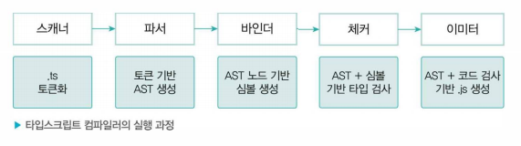

# 12/13 기술 스터디

작성 일시: 2023년 12월 8일 오후 8:54
최종 편집 일시: 2023년 12월 14일 오후 2:08
작성자: myung hun kang
상태: Backlog

# 우아한 타입스크립트

## 5장 타입 활용하기

## 5.3 커스텀 유틸리티 타입 활용하기

**유틸리티 함수를 활용해 styled-components 의 중복 타입 선언 피하기**

- props로 styled-components로 전달되면 styled-components에도 타입을 작성해야함
- 이때 props로 받은 타입과 동일할 때가 대부분
- Pick 이나 Omit 같은 타입을 활용하여 간결하게 작성가능

**Props 타입과 styled-components 타입이 중복 선언 및 문제점**

**PickOne 유틸리티 함수**

- 타입스크립트에는 서로 다른 2개 이상의 객체를 유니온 타입으로 받을 때 타입 검사가 제대로 진행되지 않는 이슈가 있다.

```tsx
type Card ={
card： string
};
type Account = {
account: string
};
function withdraw(type： Card | Account) {
}
withdraw({ card: "hyundai", account： "hana" });
```

- 위처럼 Card와 Account 중 하나의 객체만 받고 싶은 상황에서 Card | Account 로 하면 타입 검사가 제대로 이뤄지지 않는다.
- 또한 withdraw 함수의 인자로 {card: ‘hyundai’} 또는 {account : ‘hana’} 중 하나만 받고 싶지만 실제로는 card, account 속성을 모두 받아도 에러가 발생하지 않는다.

**식별할 수 있는 유니온으로 객체 타입을 유니온으로 받기**

```tsx
type Card ={
 type: "card",
 card： string
};
type Account = {
 type: "account",
 account: string
};
function withdraw(type： Card | Account) {
 ...
}
withdraw({ type: "card", card: "hyundai"})
withdraw({ type: "account", account： "hana" })
```

**PickOne 커스텀 유틸리티 타입 구현하기**

- 위 방식으로 해도 되지만 이미 구현을 다 한 상태의 코드를 위 처럼 수정하기는 것은 불편하다.
- 이럴때 사용할 수 있는 방법
- 옵셔널 + undefined 형식으로
  { account : string; card?: undefined } | { account?: undefined ; card: string }
- 즉 선택하고자 하는 하나의 속성을 제외한 나머지 값을 옵셔널 + undefined로 설정하여 원하는 속성만 받을 수 있도록 하는 방법
  ```tsx
  type PickOne<T> = {
    [P in keyof T]: Record<P, T[P]> &
      Partial<Record<Exclude<keyof T, P>, undefined>>;
  }[keyof T];
  ```

**PickOne 살펴보기**

```tsx
type One<T> = { [P in keyof T]: Record<P, T[P]> }[keyof T]

type ExcludeOne<T> = { [P in keyof T]: Partial<Record<Exclude<keyof T,P> undefined>>}[keyof T]
```

**PickOne 타입 적용하기**

- 한번에 커스텀 유틸리티 타입을 생각하기는 어렵다.
- 단계 별로 어떤 타입을 구현해야는지 생각하고 구현하는 것이 중요하다.

**NonNullable 타입 검사 함수를 사용하여 간편하게 타입 가드하기**

- null 을 가질 수 있는 값의 null 처리를 하는 방법
- if 문을 사용하는 것이 일반적이지만 is와 NonNullable 타입으로 유틸 함수를 만들어서 사용할 수 있음

**NonNullable 타입이란**

- 타입스크립트에서 제공하는 유틸리티 타입
- 제네릭으로 받은 T가 null 또는 undefined 일 때 never 또는 T를 반환하는 타입

```tsx
type NonNullable<T> = T extends null | undefined ? never : T;
```

**null, undefined를 검사해주는 NonNullable 함수**

```tsx
function NonNullable<T>(value: T): value is NonNullable<T> {
  return value !== null && value !== undefined;
}
```

**Promise.all을 사용할 때** **NonNullable 적용하기**

```tsx
class AdCampaignAPI {
	static async operating(shopNo： number)： Promise<AdCampaign[]> {
		try {
			return await fetch('/ad/shopNumber=${shopNo}');
		} catch (error) {
			return null;
		}
	}
}
```

- try catch 문을 통과해서 에러가 잡히면 null을 반환한다.

```tsx
const shopList = [
{ shopNo: 100, category: "chicken"
{ shopNo： 101, category： "pizza" },
{ shopNo： 102, category： "noodle"
];
const shopAdCampaignList = await Promise.all(shopList.map((shop)
	=> AdCampaignAPI.operating(shop.shopNo))
}
```

- 다음처럼 그냥 사용하면 값의 타입은 Array<AdCampaign[] | null>로 추론된다.
- 이때 NonNullable 함수를 사용해서 필터릴을 해 Array<AdCampaign[]>로 추론 되도록 한다.

```tsx
const shopList = [
{ shopNo： 100, category: "chicken" },
{ shopNo： 101, category: "pizza" }3
{ shopNo： 102, category： "noodle"
];
const shopAdCampaignList = await Promise.all(shopList.map((shop)
=> AdCampaignAPI.operating(shop.shopNo))
);
const shopAds = shopAdCampaignList.filter(NonNullable);
```

> PickOne<T> 과 같은 커스텀 유틸리티 함수 이해가 어렵다.
> → 아직 이르다. ⇒ type challenges를 풀면 실력이 늘 수도 있다.

## 5.4 불변 객체 타입으로 활용하기

- as const와 keyof 연산자 활용

**Atom 컴포넌트에서 theme style 객체 활용하기**

- 작은 컴포넌트 (button, header, input 등)는 폰트 크기, 폰트 색상, 배경 색상 등에 유연하게 사용되어야함
- 색상 값을 props로 직접 넘겨 줄 수도 있지만, 변경사항에 대응하기에 번거로움이 많다.
- 스타일을 관리하는 theme 객체를 두고 관리

**타입스크립트 keyof 연산자로 객체의 키값을 타입으로 추출하기**

```tsx
interface ColorType {
  red: string;
  green: string;
  blue: string;
}

type ColorKeyType = keyof ColorType; // 'red' | 'green' | 'blue'
```

**타입스크립트 typeof 연산자로 객체의 키값을 타입으로 추출하기**

```tsx
const colors = {
	red: "#45452"，
	green: "#C952A",
	blue: "#1A7CFF"、
};

type ColorsType = typeof colors；
/**
{
	red： string;
	green： string;
	blue： string;
}
*/
```

**객체의 타입을 활용해서 컴포넌트 구현하기**

> 5.3이 뒤에 나왔어야하지 않나….
> typeof keyof 뭐시기

## 5.5 Record 원시 타입 키 개선하기

- Record를 명시적으로 사용하는 방안

**무한한 키를 집합으로 가지는 Record**

**유닛 타입으로 변경하기**

- 키가 유한한 집합일 때 유닛 타입을 사용할 수 있다.
- 단, 키가 무한한 상황에서는 적합하지 않다.

**Partial을 활용하여 정확한 타입 표현하기**

```tsx
type PartialRecord<K extends string, T> = Partial<Record<K,T>>
type Category = string;
interface Food {
	name： string;
	//...
}

const foodByCategory： PartialRecord<Category, Food[]> = {
	한식: [{ name： "제육덮밥" }, { name： "뚝배기 불고기" }],
	일식: [{ name： "초밥" }, { name： "텐동" }],
};

foodByCategory["양식"]; // Food[] 또는 undefined 타입으로 추론
foodByCategory["양식"].map((food) => console.log(food.name));
// Object is possibly 'undefined'
foodByCateg()ry["양식"]?.map((food) => console. log (food .name)); // OK
```

- 타입스크립트가 foodByCategory[key]를 Food[ ] 또는 undefined로 추론하여 해당 값에 대한 처리가 필요하다는 메시지를 남긴다.
- 개발자는 이에 대해 조치를 취할 수 있게 되므로 사전에 에러를 방지할 수 있다.

> 왜 5.3이 먼저 나왔는지 이해 안됨,
> PartialRecord 은 커스텀 유틸리티 함수 부분

## 6장 타입스크립트 컴파일

## 6.1 자바스크립트의 런타임과 타입스크립트의 컴파일

**런타임과 컴파일타입**

- 컴파일 타입 - 소스코드가 컴파일러에 의해 기계어 코드를 변환되어 실행이 가능한 프로그램이 되는 과정
- 런타임 - 컴파일이 완료된 후 프로그램이 메모리에 적재되어 실행되는 것

**자바스크립트 런타임**

**타입스크립트의 컴파일**

- 일반적인 컴파일과 달리 타입스크립트의 컴파일은 ts → js 가 되는 것
- 소스 대 소스 컴파일러라고도 불림
- 소스코드를 해석해서 AST(최소 구문 트리)를 만들고 이후 타입 확인을 거친 다음에 결과 코드를 생성
- 전체 과정
  1 타입스크립트 소스코드를 타입스크립트 AST로 만든다. （tsc）
  2 타입 검사기가 AST를확인하여 타입을획인한다. （tsc）
  3 타입스크립트 AST를 자바스크립트 소스로 변환한다. （tsc）
  4 자바스크립트 소스코드를 자바스크립트 AST로 만든다. （런타임）
  5 AST가 바이트 코드로 변환된다. （런타임）
  6 런타임에서 바이트 코드가 평가evaluate되어 프로그램이 실행된다. （런타임）

## 6.2 타입스크립트 컴파일러의 동작

**코드 검사기로서의 타입스크립트 컴파일러**

- 문법 오류 에러 뿐만 아니라 타입 에러도 잡아낸다.

**코드 변환기로서의 타입스크립트 컴파일러**

- 타입스크립트 컴파일러의 target 옵션으로 특정 버전의 js로 컴파일 할 수 있다.
- 타입스크립트 컴파일러의 역할
  - 최신 버전의 타입스크립트 \* 자바스크립트 코드를 구버전의 자바스크립트로 트랜스파일한다.
  - 코드의 타입 오류를 검사한다.

> 아는 내용

## 6.3 타입스크립트 컴파일러의 구조



**프로그램**

- 컴파일 과정을 관리하는 프로그램 객체가 생성됨
- 가장 최초로 불러온 파일을 기준으로 컴파일 과정이 시작

**스캐너**

- 소스 파일을 어휘적으로 분석하여 토큰을 생성하는 역할


**파서**

- 토큰 정보를 이용하여 AST를 생성
- AST는 컴파일러가 동작하는 데 핵심 기반이 되는 자료 구조로, 소스코드의 구조를 트리형태로 표현한다.
- 최상위 노드는 타입스크립트 소스파일, 최하위는 파일의 끝 지점
- 위 과정으로 생성된 토큰 목록을 활용하여 구문적 분서 수행


**바인더**

- 후술한 체커 단계에서 타입 검사를 할 수 있도록 기반을 마련하는 단계
- 타입 검사를 위해 심볼 데이터 구조를 생성

```tsx
type SomeType = string ! number;
interface Somelnterface {
	name： string;
	age?： number;
}

let foo: string = "LET";
const obj = {
	name： "이름",
	age： 10,

class MyClass {
	name;
	age;
	constructor(name: string, age?: number) {
		this.name = name;
		this .age = age ?? 0;
	}
}

const arrowFunction = 0 => 0；
function normalFunction() 0

arrowFunctionO；
normalFunctionO；

const colin = new MyClassfcolin");
```

위 코드에 대한 심볼


**체커와 이미터**

체커

- 파서가 생성한 AST와 바인더가 생성한 심볼을 활용해 타입 검사 수행
- 매우 비중이 큰 과정
- 체커의 타입검사는 다음 컴파일 단계인 이미터에서 실행된다.

이미터

- 타입스크립트 소스 파일을 js 와 타입 선언파일(d.ts)로 생성한다.
- 파일 변환 과정에서 개발자가 설정한 ts 설정 파일을 읽어오고, 체커를 통해 코드에 대한 타입 검증 정보를 가져온다.
- emitter.ts 소스 파일 내부의 emitFiles() 함수를 사용해 ts 소스 변환을 진행

전체 컴파일 과정


> ts 파일이 js가 되어 실행되는 전체 과정
> 대략적으로나마 알고 있어야하는 내용같다.

# 다음 시간 수 7

7장 비동기 호출
