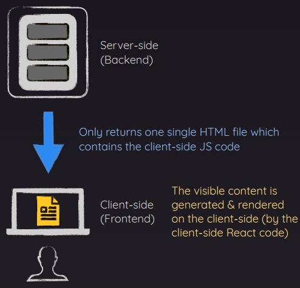

# 02/07 기술 스터디

작성 일시: 2024년 2월 6일 오후 8:22
최종 편집 일시: 2024년 2월 7일 오후 9:23
작성자: myung hun kang
상태: Backlog

## NextJS 핵심 (앱 라우터)

연습문제 해답 이후부터

1. layout.jsx
2. css : Module.css
3. **Image** : [https://nextjs.org/docs/app/api-reference/components/image](https://nextjs.org/docs/app/api-reference/components/image) 태그 요소들 사용법 알아두면 좋을 듯 (ex) fill , priority , loading
4. app 안에 파일 다 두기 vs page 와 관련없는 폴더 app 밖으로 빼기
5. Server Component vs Client Component 104 번 강의 잘 숙지하면 좋을 듯
   - 참고 자료
     ### Vanilla React Apps Render On The Client
     
     ### With NextJS, You Build Fullstack Applications
     ### Server- & Client-side Working Together
     The backend **executes the server component functions** & hence derives the to-be-rendered HTML code
     The client-side **receives & renders** the to-be-rendered HTML code
     ### **React Server Components(RSC)**
     - Components that are **only** rendered on the server
     - By default, all React components (in NextJS apps) are RSCs
     - Advantage: Less client-side JS, great for SEO
     ### **Client Components**
     - Components that are **pre-rendered** on the server but then also **potentially on the client**
     - Opt-in via `“use client”` directive
     - Advantage: Client-side interactivity
     
6. client component 효율적 사용 → 최대한 client 쪽에서 사용되어지는 부분만 빼서 컴포넌트로 만들기 → 큰 틀에서는 server side, 세부적으로 client side
7. SQLite 사용 DB 설정

   - “better-sqlite3” 사용 간단 DB 구축

   실제 사용한다면 : mysql 다운 받아서 백그라운드에서 실행해둠 →3306 포트 , nextjs 내부에 코드로 DB와 연결시킴 , 서버 코드에서 관련 라이브러리 메서드로 연결

8. loading.jsx 로 로딩 페이지 만들기
9. Suspense & Streamed Response

```jsx
<Suspense fallback={<p className={classes.loading}>Fetching meals...</p>}>
  <Meals />
</Suspense>
```

1. 오류 처리 : error.js 로 에러 페이지 처리
2. Notfound: not-found.js 로 없는 페이지 처리
3. [slug] :동적경로

   ```jsx
   function DetailMealPage({ params }) {
     const meal = getMeal(params.mealSlug);
   }
   ```

4. notFound 처리:

   ```jsx
   import { notFound } from "next/navigation";

   export async function generateMetadata({ params }) {
     const meal = getMeal(params.mealSlug);

     if (!meal) {
       notFound();
     }
   }
   ```

5. imagePicker 만들기
6. server Action : form 제출

   ```jsx
   React : onSubmit={submitHandler},
   NextJS : action={actionHandler}

   const function actionHandler(){
   "use server"
   const meals = shareMeal()
   }
   // action을 따로 컴포넌트로 빼면

   "use server"
   const function shareMeal(){
   	return data
   }

   <form action={shareMeal}>
   ```

7. XSS 보호 (cross site scripting) , SQL injection 방지

   xss 라이브러리 사용

8. useFormStatus, useFormState

   ```jsx
   "use client";

   import { useFormStatus } from "react-dom";

   export default function MealsFormSubmit() {
     const { pending } = useFormStatus();

     return (
       <button disabled={pending}>
         {pending ? "Submitting... " : "Share Meal"}
       </button>
     );
   }
   ```

   ```jsx
   "use client";
   import { useFormState } from "react-dom";
   import ImagePicker from "@/commponents/meals/image-picker";
   import classes from "./page.module.css";
   import { shareMeal } from "@/lib/action";
   import MealsFormSubmit from "@/commponents/meals/meals-form-submit";

   export default function ShareMealPage() {
     const [state, formAction] = useFormState(shareMeal, { message: null });

     return (
       <>
         <header className={classes.header}>
           <h1>
             Share your <span className={classes.highlight}>favorite meal</span>
           </h1>
           <p>Or any other meal you feel needs sharing!</p>
         </header>
         <main className={classes.main}>
           <form className={classes.form} action={formAction}>
             <div className={classes.row}>
               <p>
   				...
   		</>
   	)
   }
   ```

9. 캐싱

   revalidatePath(”/meals”) 이 안에 쓴 경로에 대한 캐시 값을 revalidate 하는 거

10. 메타데이터 넣기

    ```jsx
    export const metadata = {
      title: "NextLevel Food",
      description: "Delicious meals, shared by a food-loving community.",
    };

    export async function generateMetadata({ params }) {
      const meal = getMeal(params.mealSlug);

      if (!meal) {
        notFound();
      }

      return {
        title: meal.title,
        description: meal.summary,
      };
    }
    ```

React에서 사용하는 최적화 기법이 nextjs 에 녹아있는 것이 또 다른 nextjs 의 장점이다.

- 재욱

  - .module.css 파일에서 임포트 해와서 classes 혹은 styles 같이 사용.

  - class 대신 className

  -  => <image srr={logo} />

  - 넥스트에서 <image> 를 사용하면 png 를 wepb 로 알아서 변환 하듯 브라우저에 맞게 최적화 됨.

  - 넥스트는 리액트 서버 컴포넌츠.
    -> 모든 컴포넌트는 서버에서 렌더링.
    -> 서버 컴포넌츠는 클라이언트에서 로그 확인 불가. ( 서버에서 로그 확인)
    -> 왜 쓰는가. 서버 컴포넌트를 사용하는 장점. - 다운로드 해야하는 클라이언트 측의 js 코드를 줄여 웹사이트의 성능 향상. - 검색 엔진 최적화에도 도움. ( 웹 검색 크롤러가 완성 컨텐츠가 포함된 페이지를 볼수있음.)
    -- 클라이언트 컴포넌츠 코드에선 페이지 소스 코드가 비어있음.
  - 넥스트는 클라이언트 컴포넌츠 의 장점도 가짐.

    - 대표 예시가 유즈스테이트나 이펙트 같은 훅.
    - 온클릭 이벤트 같은 이벤트핸들러.

  - next/navigation의 usePathname() 을 사용해서 className을 startsWith()를 활용. 하이라이트 사용 가능.

  - 클라이언트 컴포넌트를 쓰는 곳을 최대한 아래로 내린뒤 그곳에서만 use client 를 사용.

  - 넥스트는 동적 이미지의 폭이나 넓이를 명시적으로 설정 할수 없음.
    -> 빌드타임에 사용할수 없고 런타임에서만 해당되기 때문.
    -> 따라서 fill 속성을 추가하여 해결 가능.

  - SQLite 라이브러리로 db 설정 가능. (더미 데이터)

  - next로 데이터 요청하는 방법

    - useEffect 속에 fetch 사용해서 백엔드에서 데이터 받는 방법. 일반적으로 사용하듯이 하는법.
    - 넥스트는 서버 컴포넌츠기에 리액트와 달리 사용 가능.

  - 넥스트는 한번 방문한 페이지는 모두 캐싱하는 보이지 않는 캐싱을 강하게 함.

  - loading 도 고정 이름.

  - 리액트의 <Suspense> 를 사용하면 로딩을 쉽게 사용 가능. fallback 에 로딩시 보여질 화면 넣어주면 됨.

  - error 도 고정이름.
  - error 도 클라이언트 컴포넌츠

  - not-found 도 고정.
  - 에러나 낫파운드는 가장 가까운 파일을 실행.(하위)

  - use server 를 사용해 서버 액션 사용.
  - use server 와 use client 동시 사용 불가. -> 서버 컴포넌츠와 클라이언트 컴포넌츠 공존 불가.
  - 따라서 action 파일을 개별로 생성해 서버액션을 저장함으로서 해결 가능.

  - Cross-Site Scripting를 방지하기 위해 xss 패키지 사용.

  - useFormStatus by react-dom 을 통해 더 쉽게 관리. 단 클라이언트 컴포넌츠.
    - 제출 되고 있는지 여부 확인.
  - useFormState by react-dom 도 마찬가지. 대신 response 관리 가능.

    - 제출 되는지 상태 관리.

  - 빌드 단계에서 모두 렌더링 하고 공격적인 캐싱으로 리패치를 하지 않음.
    -> 이를 해결하기 위해 액션이 일어날때마다 캐시를 일부 혹은 전체를 비워야함
    -> revalidatePath() 를 사용하면 유효성을 재검사하여 캐시를 비움.
    -> 한 페이지만 하면 되면 그냥 경로를, 모든 페이지를 하고싶다면 ,layout을 하여 레이아웃이 사용된 모든 페이지를 검사 가능.

- 진영

- 명훈
  ## Image 태그
  [https://nextjs.org/docs/app/api-reference/components/image](https://nextjs.org/docs/app/api-reference/components/image)
  - nextjs가 가지는 특징 중 하나.
  - img 를 사용할 때 앱에 좀 더 효율적으로 사용할 수 있도록 기본적인 셋팅이 되어있는 태그
  - 특징들로는
    - 알아서 lazyloading을 해준다.
    - 확장자를 웹에 특화된 .webp 를 사용하도록 해준다.
    - img 를 담고있는 태그와 css 에 따라 알아서 크기를 조절 (빌드할 때 import 하는 이미지들만)
    - priority 설정으로 앱 화면이 로드될 때 같이 pre-load되게 설정도 가능
    - 등 많은 기능이 있다.
  - 동적으로 가져오는 이미지에 대해서는 width , height 둘 다 지정해줘야한다.
    - 지정이 힘든 상황에는 fill 로 해서 부모 컴포넌트에 가능한 공간안을 이미지로 채운다는 뜻이다.
  ## Server vs Client Components
  모든 컴포넌트를 클라이언트 쪽에서 렌더링해 개발하게 도와주는 vite 나 CRA 같은 것들과 다르게
  Nextjs 는 모두 서버 사이드에서 렌더링 되는 것이 디폴트이다. (React Server Components)
  → nextjs에 백엔드가 같이 있어서 거기서 렌더링해서 보여줌
  client 사이드 렌더링이 필요한 경우
  - onClick 과 같은 dom 과 상호작용을 다루기 위해
  - useState, useEffect와 같은 기본 react client side hook 을 사용하기 위해
  server 쪽이 아닌 client 에서 렌더링을 하려면
  → 파일 맨 앞에 “use client” 를 붙여야한다.
  ```jsx
  "use client";
  import { useEffect, useState } from "react";
  import Image from "next/image";

  export default function ImageSlideshow() {
    const [currentImageIndex, setCurrentImageIndex] = useState(0);

    useEffect(() => {
      const interval = setInterval(() => {
        setCurrentImageIndex((prevIndex) =>
          prevIndex < images.length - 1 ? prevIndex + 1 : 0
        );
      }, 5000);

      return () => clearInterval(interval);
    }, []);

    return (
      <div className={classes.slideshow}>
        {images.map((image, index) => (
          <Image
            key={index}
            src={image.image}
            className={index === currentImageIndex ? classes.active : ""}
            alt={image.alt}
          />
        ))}
      </div>
    );
  }
  ```
  ### 최대한 큰 페이지의 틀은 server side 에서 꼭 필요한 부분만 client side 에서 구동할 수 있도록 해서 nextjs 의 장점을 가져가는 것이 중요
  ### SQL 문 injection
  - **클라이언트의 입력값을 조작하여 서버의 데이터베이스를 공격할 수 있는 공격방식**
  -
  ### server action
  server component 안에서 server로 특정 요청(action)을 보낼때 함수 내부에 ‘use server’ 를 작성하므로써 함수가 서버에서만 동작할 수 있도록 해주는 방법
  server action 을 통해 form 제출도 서버 컴포넌트에서 가능하다.
  ```jsx
  import ImagePicker from "@/commponents/meals/image-picker";
  import classes from "./page.module.css";

  export default function ShareMealPage() {
    async function shareMeal(formData) {
      "use server";

      const meal = {
        title: formData.get("title"),
        summary: formData.get("summary"),
        instructions: formData.get("instructions"),
        image: formData.get("image"),
        creator: formData.get("name"),
        creator_email: formData.get("email"),
      };

      console.log(meal);
    }
  ```
  - 단 ‘user client’ 된 컴포넌트에서는 에러가 난다.
    에러를 피하기 위해서는 ‘use server’를 사용하는 함수를 따로 ‘use server’로 된 파일에서 action 만 모아서 다루고 ‘use client’ 를 사용하는 측에서 import 해서 사용하면 된다.
  ### xss 방지를 위한 xxs 라이브러리
  코드내에서 xss 에 취약한 요소를 사용하는 경우 xss 를 검열해서 깨끗한 경우에만 데이터를 db에 저장하도록 한다.
  ```jsx
  export function saveMeal(meal) {
    meal.slug = slugify(meal.title, { lower: true });
    meal.instructions = xss(meal.instructions);
  }
  ```
  ### useFormStatus, useFormState
  vs react form hook 사용

## 다음시간 수

섹션 4 다 듣고 오기
