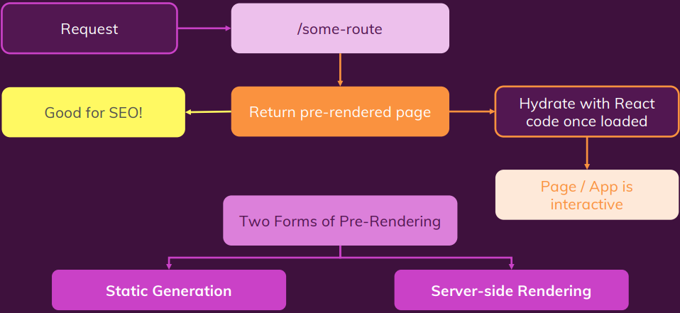

# 02/21 기술 스터디

작성 일시: 2024년 2월 21일 오후 7:05
최종 편집 일시: 2024년 2월 27일 오전 4:12
작성자: myung hun kang
상태: Backlog

## 섹션 5 ~ 180 강 까지

### 섹션 5

섹션 4에서 배운 내용을 기반으로 한 간단한 프로젝트 실습

동적 라우트

catch-all 라우트

\_app.js ⇒ layout.js 와 유사

## **<Link> 와 NextJS 버전13**

NextJS 13 이전 버전에서는 `<Link>` 태그 안에 중첩된 `<a>` 요소를 넣어야 커스텀 속성(className 등)을 앵커 요소에 추가할 수 있었습니다.

예를 들어, 다음은 NextJS 13 이전 버전에서 유효하지 않은 코드 예시입니다.


대신, 다음과 같이 작성해야 합니다.


`<Link>` 태그 안에 다른 추가 요소를 넣을 때도 같은 솔루션을 적용할 수 있습니다.

`<a>`요소로 추가로 넣은 요소(빈 요소일 수 있음)를 감싸야 합니다:


NextJS 13 혹은 상위 버전 사용 시에는 위 과정이 필요없고, 그냥 다음과 같이 코드를 작성하면 됩니다:


본 강의는 NextJS 13버전 release 이전에 녹화되었기 때문에, **다음 강의에서는 NextJS 13 이전 버전이 사용됩니다.**

13 버전을 쓰신다면( `package.json`  파일을 통해 확인하세요),

다음 강의의 **솔루션을 적용하지 마시고**, 앞서 설명해드린 대로 `<a>`요소 없이 코드를 작성하세요.

---

### 섹션 6

### nextjs 의 사전 렌더링

정적 html → 넘기면 → client 에서 hydrate 해서 사용한다.


- 두가지 방법이 → getStaticProps랑 getServerSideProps가 있다.

## getStaticProps

→ SSG

빌드하는 동안 페이지 사전 생성 ⇒ npm run build 할 때

```jsx
export async function getStaticProps(context) {}
```

- 여기에 작성된 코드는 client side에 재전송되는 코드에 포함되지 않는다
  → client 측에 보여서는 안되는 중요한 data를 다루는 코드를 여기서 사용할 수 있다.
- 여기서 보내지는 props를 가지고 page component에서 구현을 하고 client 로 보낸다. 하지만 코드는 보내지 않기 때문에 검사 탭의 소스를 둘러봐도 코드는 찾을 수 없다.

예시

```jsx
import fs from "fs/promises";
import path from "path";

function HomePage(props) {
  const { products } = props;
  return (
    <ul>
      {products.map((product) => (
        <li key={product.id}>{product.title}</li>
      ))}
    </ul>
  );
}

export async function getStaticProps() {
  const filePath = path.join(process.cwd(), "dummy-backend.json");
  const jsonData = await fs.readFile(filePath);
  const data = JSON.parse(jsonData);
  return {
    props: {
      products: data.products,
    },
  };
}

export default HomePage;
```

### Incremental Static Generation(ISR 증분 정적 생성)

```jsx
export async function getStaticProps() {
  const filePath = path.join(process.cwd(), "dummy-backend.json");
  const jsonData = await fs.readFile(filePath);
  const data = JSON.parse(jsonData);
  return {
    props: {
      products: data.products,
    },
    revalidate: 10, // 10초마다 페이지 재생성
  };
}
```

이 두개 말고 다른 것도 있다.

- notFound : boolean → true 면 404 페이지를 띄운다.
  - data fetching 이 실패하거나 하는 경우 사용
- redirect : 404말고 다른 라우트로 이동시키고 싶을때

---

- 명훈

  ## \_app.js 파일

  nextjs14 에서 app 폴더 내 layout 페이지와 비슷한 역할을 함

  ## client slide rendering의 문제점

  ## getStaticProps

  빌드하는 동안 페이지 사전 생성

  ```jsx
  export async function getStaticProps(context) {}
  ```

  - 여기에 작성된 코드는 client side에 재전송되는 코드에 포함되지 않는다
    → client 측에 보여서는 안되는 중요한 data를 다루는 코드를 여기서 사용할 수 있다.
  - 여기서 보내지는 props를 가지고 page component에서 구현을 하고 client 로 보낸다. 하지만 코드는 보내지 않기 때문에 검사 탭의 소스를 둘러봐도 코드는 찾을 수 없다.

  예시

  ```jsx
  import fs from "fs/promises";
  import path from "path";

  function HomePage(props) {
    const { products } = props;
    return (
      <ul>
        {products.map((product) => (
          <li key={product.id}>{product.title}</li>
        ))}
      </ul>
    );
  }

  export async function getStaticProps() {
    const filePath = path.join(process.cwd(), "dummy-backend.json");
    const jsonData = await fs.readFile(filePath);
    const data = JSON.parse(jsonData);
    return {
      props: {
        products: data.products,
      },
    };
  }

  export default HomePage;
  ```

  ## 내부에서 일어나는 일

  npm run build 를 하면 터미널 로그에 어떻게 빌드가 되는지 나온다.

  ## 증분 정적 생성 ISR

  - 서버에서 불러올 데이터가 자주 변하는 데이터라면 ?
    → 배포된 이후라도 x 초마다 정적 페이지를 새로 만들어주는 방식

  ```jsx
  export async function getStaticProps() {
    const filePath = path.join(process.cwd(), "dummy-backend.json");
    const jsonData = await fs.readFile(filePath);
    const data = JSON.parse(jsonData);
    return {
      props: {
        products: data.products,
      },
      revalidate: 10, // 10초마다 페이지 재생성
    };
  }
  ```

  ## ISR 내부에서 일어나는 일

  ## getStaticProps 구성 옵션

  ```jsx
  export async function getStaticProps(context) {}
  ```

  여기서 볼 수 있듯 context를 props 로 받을 수 있다.

  - 페이지 매개 변수 같은걸 얻을 수 있다는 것

  ```jsx
  return {
    props: {
      products: data.products,
    },
    revalidate: 10, // 10초마다 페이지 재생성
  };
  ```

  이 두개 말고 다른 것도 있다.

  - notFound : boolean → true 면 404 페이지를 띄운다.
    - data fetching 이 실패하거나 하는 경우 사용
  - redirect : 404말고 다른 라우트로 이동시키고 싶을때
    ```jsx
    redirect: {
      destination: "/no-data";
    }
    ```

- 재욱

  - 라우팅이 넥스트를 쓰는 주된 이유이긴 하지만 유일은 아님.
  - 서버사이드로 사전 렌더링 또한 아주 중요.
  - 기존 리액트 앱(그리고 데이터 페칭)의 문제점.
    - 더미데이터를 사용하는 경우 api를 통해 가져오는 동안 시간이 지연되는 문제 발생.
    - 블로그나 쇼핑몰 같이 필요한 경우 검색엔진이 콘텐츠를 찾을수 없음.
    - 컴포넌트가 로딩된 후 데이터가 페칭되어야 한다는 뜻.
    - 이를 넥스트의 내장된 서버사이드 렌더링 기능으로 해결 가능.
  - 표준 리액트라면 빈 HTML 파일과 모든 JS코드가 표시된 후 JS 코드가 실행되면 스크린에 내용이 표시.
    - 물론 빨라서 문제로 보이지 않을수 있음.
    - 하지만 일반적인 DOM 이외의 데이터가 서버로 부터 로딩된다면 시간이 소요. ( 다른 데이터 페칭 )
    - 즉, 페이지를 다시 클라이언트로 전송한 뒤 데이터를 로딩하는 일반과 달리 넥스트를 사용하면 모든 데이터가 있는 HTML 콘텐츠를 사전에 렌더링 가능.
  - 페이지를 방문하면 로딩되는 첫번째 페이지만 사전 렌더링하고 이후 상호작용과 관련된 기능은 다시 싱글 페이지 애플리케이션으로 작용.
  - 사전 렌더링 양식은 두가지.
    - 첫번째이자 권장 양식 : 정적 생석(Static Generation)
      - 빌드 되는동안 모든 페이지가 사전 생성.
    - 두번째 양식 : 서버 사이드 렌더링 ( Server side Rendering)
      - 배포 후 요청이 서버까지 오는 그때 모든 페이지가 생성.
    - 두가지를 함께 사용하는 방식도 있음.
  - 정적 생성.
    - 빌드하는 동안 페이지를 사전 생성.
      - 콘텐츠를 구성하는 모든 HTML 코드와 모든 데이터를 사전에 준비.
      - 즉 보통 서버사이드에서만 실행되는 코드를 빌드 프로세스 동안 실행되도록 허용.
    - 빌드 시간은 배포 전 앱을 구축 할 때를 말하며 빌드 시간 동안 페이지가 사전에 구축 되었기 때문에 배포되고 나면 구축된 페이지는 서버나 앱을 실행시키는 CDN을 통해서 캐시로 저장.
    - 이에 사전 구축된 페이지를 통해서 즉시 입력 요청이 실행 가능.
    - 해당 페이지가 표시되고 난 뒤에도 리액트 앱을 통해 수화(Hydrate) 작업을 거침.
      결국 표준 리액트 앱이 됨.
    - 즉 기존의 리액트 앱과 다른 점은 빈페이지가 아니라 사전에 콘텐츠로 채워져 있다는 뜻. 또한 작업 가능한 일반 리액트 앱.
  - 어떤 페이지를 사전에 생성하는 지 지정하는 것이 중요. 어떤 데이터가 포함되어야 할까?
  - 해답은 getStaticProps.
    - 페이지 컴포넌트에서 가져올수있는 특정 함수.
    - pages 폴더의 component 파일 내부에 반드시 위치.
    - 특수한 비동기 함수인 이름이 정확히 getStaticProps.
    - 프로미스를 반환하는 비동기 함수로 그안에 await 키워드를 사용 가능.
    - 주목할 점은 보통 서버사이드에서만 실행되는 모든 코드도 실행 가능.
    - 이 함수에서는 클라이어튼 사이드 코드로만 제한 X.
    - 특정 클라이언트 사이드 api에 엑세스가 없거나 윈도우 객체에 대한 액세스가 없는 일반적으로는 서버사이드에서만 가능한 모든 코드도 실행 가능.
    - 나아가 getStaticProps 내에 작성된 코드는 클라이언트에게 재전송되는 코드로 포함 X.
    - 즉 해당 함수 내에 포함하는 코드는 클라이언트는 볼수 없음.
    - 넥스트는 기본적으로 모든 파일을 사전 렌더링 함.
    - 모든 페이지 파일에 추가 가능하지만 페이지에만 추가가능하며 Export 해야함.
    - 파일시스템 (fs)는 노드js의 핵심 모듈. 따라서 클라이언트 사이드에서 작업 불가.
  - npm build 를 통해 내부에서 일어나는 일을 볼수 있음.
  - 사전 렌더링을 한뒤 정적인 경우가 아닌 자주 바뀌는 데이터의 경우 해결법.
    1. useEffect를 사용.
    2. 증분 정적 생성 (ISR) 이라는 내장기능.
       - 페이지를 빌드할때 정적으로 한번만 생성하지 않고 배포 후에도 계속 업데이트.
       - getStaticProps 에 revalidate 옵션을 주어 시간마다 업데이트 가능. (초 단위)
  - getStaticProps 에 데이터 페칭에 문제가 생겼을 때 사용할 옵션.
    - notFound : true 로 주면 404페이지를 띄워줌.
    - redirect : 404페이지가 아닌 다른 페이지로 연결할 때 사용.

- 기존 React 앱(그리고 데이터 페칭)의 문제점
  리액트에선 JS코드에 데이터를 로딩, 임포트하는 것이 아니라 브라우저에서 HTTP 요청을 통해 데이터를 받음
  → 속도 느리고 딜레이가 생김
  리액트 소스코드 html을 열어보면 뭐가 잔뜩 렌더링 되어있든 그저 비어있는 root 컴포넌트만 딸랑 있을 뿐임
  → 구린 SEO
- NextJS가 페이지를 준비하고 & 사전 렌더링하는 방식
  ### Page Pre-Rendering
  
  넥스트로 만든 앱을 요청하면
  폼, 이벤트 다루기 등 인터액션을 위한 리액트 코드는 제외하고
  HTML을 pre render해줌
  즉, 리액트 앱과의 차이는 넥스트는 리액트처럼 컨텐츠가 비어있는 페이지를 넘겨주는게 아니라 ‘pre render된 페이지 + 리액트 코드가 담긴 JS’를 넘겨준다는 것.
  **기본적으로 리액트 코드가 작동하는 앱인데, 첨에 던져주는게 마냥 빈 페이지가 아닌거임**
  이 pre rendering도 두 방식이 있는데
  1. Static Generation

     권장되는 방식, 빌드 단계에서 페이지가 pre rendering(배포 단계 이전에 준비됨)

  2. Server-side Rendering(SSR)

     대안, 배포 후 request 받는 순간 페이지 생성

---

- `getStaticProps`를 통한 정적 생성의 개요 **([앱라우터에선 대체됨](https://nextjs.org/docs/app/api-reference/functions/generate-static-params))**
  이제 해야할 고민, 사전 생성할 페이지를 위해 어떤 데이터가 필요할까?
  ### Static Generation
  Pre-generate a page (with data prepared on the server-side) during build time
  →
  Pages are prepared ahead to time and can be cached by the server / CDN serving the app
  ```jsx
  export **async** function **getStaticProps**(***컨텍스트***) { *…* }
  ```
  요 안에 작성한 코드는 클라이언트에 전송되지 않음
- 페이지에 `getStaticProps` 추가하기 && 서버 사이드 코드 실행하기 & Filesystem 사용하기
  ```jsx
  import React from "react";

  export default function FooPage({ products }) {
    return (
      <ul>
        {products.map((product) => (
          <li key={product.id}>{product.title}</li>
        ))}
      </ul>
    );
  }

  export async function getStaticProps() {
    return {
      props: {
        products: [
          { id: "p1", title: "Product 1" },
          { id: "p2", title: "Product 2" },
        ],
      },
    }; // props key가 포함된 object를 반환해야함. 컴포넌트의 프롭과 링크됨
  } // 마련해두면 넥스트가 알아서 이거 돌리고 그 다음 컴포넌트 함수 돌림
  ```
  파일시스템 사용
  `dummy-data/dummy-backend.json`
  ```json
  {
    "products": [
      { "id": "p1", "title": "Product 1", "description": "This is product 1" },
      { "id": "p2", "title": "Product 2", "description": "This is product 2" },
      { "id": "p3", "title": "Product 3", "description": "This is product 3" }
    ]
  }
  ```
  `app/foo/page.js`
  ```jsx
  import path from "path";
  import fs from "fs/promises"; // 브라우저에서 동작하지 않는 서버측 모듈

  export default function FooPage({ products }) {
    return (
      <ul>
        {products.map((product) => (
          <li key={product.id}>{product.title}</li>
        ))}
      </ul>
    );
  }

  export async function getStaticProps() {
    const filePath = path.join(
      process.cwd(),
      "dummy-data",
      "dummy-backend.json"
    ); // Current Working Directory
    const jsonData = await fs.readFile(filePath);
    const data = JSON.parse(jsonData);

    return {
      props: {
        products: data.products,
      },
    };
  }
  ```
- Incremental Static Generation(ISR) 활용하기
  페이지에서 프리렌더링되는 데이터가 동적이라면 앞에서 배운 정도로는 충분히 구현할 수 없죠
  방법1. 프리렌더링도 하면서 useEffect 좀 섞기
  방법2. Incremental Static Generation
  
  프리렌더링은 빌드할때 딱 한번만 되는게 아니고 배포후 일정 시간마다 재생성되게 할 수 있덩
  이 경우
  ```jsx
  export async function getStaticProps() {
    return {
      props: {
        products: data.products,
      },
    };
  }
  ```
  이랬던 코드에 **`revalidate`** 키를 더해주면 된다
  ```jsx
  export async function getStaticProps() {
    return {
      props: {
        products: data.products,
  			**revalidate: 600 // 600초마다 재생성**
      },
    };
  }
  ```

## 다음시간 수 7시

180강 ~ 섹션 7까지
